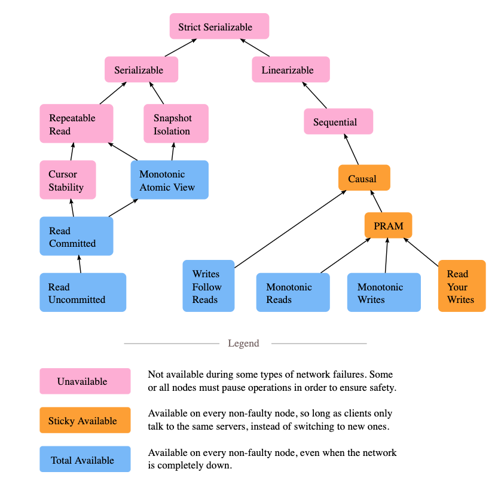
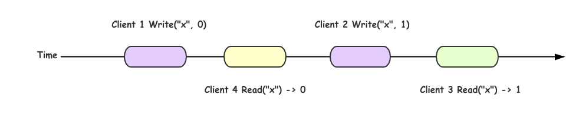
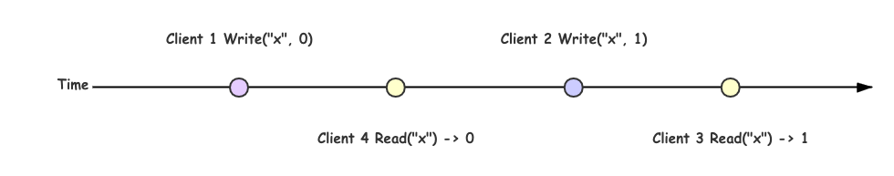
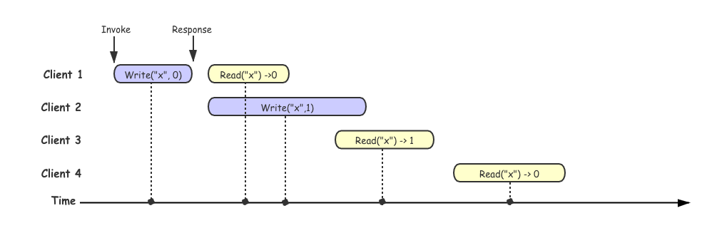
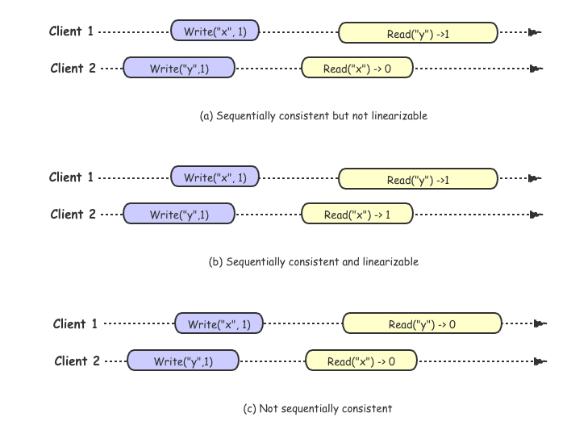
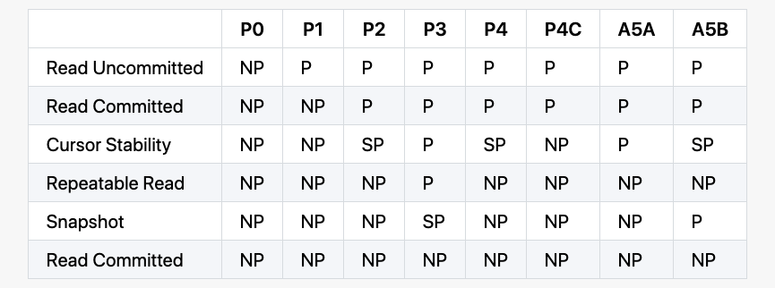

title: 一致性模型笔记
author: cwen
date: 2020-04-26
update: 2020-04-26
tags:
    - Linearizability
    - Serializability
    - CAP
    - 分布式

---

谈到分布式系统，一致性的问题就不得不被提到，可以说是一个老生长谈的话题，这几天在准备一个关于分布式测试相关的分享的时候，涉及到一些一致性和一致性验证相关的问题，但是突然发现自己的脑子里差不多一片空白，之前也有看过相关的论文和一些实践项目，可能是由于没有自己实际去实践导致很多概念都不太清楚，就重新学习了一波，并整理一些相关的笔记（毕竟好记性不如烂笔头，如果笔记中存在错误，还请指出来帮助我改正）帮助更好的理解这些概念。
<!--more-->

数据库和分布式系统中都有一致性的概念，如数据库四大特征 `ACID` 中的 `C` 就是 `Consistency` 的简写，只是这个一致性强调的是数据库逻辑的一致性，保证事务前后的数据都符合业务里的不变性约束，比如保证外键约束等。再比如分布式理论 `CAP` 中的 `C` 也是一致性，这里的一致性主要强调是读操作是否能够读到最新的结果，以及并发场景下操作执行的时序关系，一般而言，分布式系统中的一致性从强到弱可以分为四种：

1. [线性一致性 （Linearizability：Strong consistency or Atomic consistency)](https://en.wikipedia.org/wiki/Linearizability)
2. [顺序一致性（Sequential consistency）](https://en.wikipedia.org/wiki/Sequential_consistency)
3. [因果一致性（Causal consistency）](https://en.wikipedia.org/wiki/Causal_consistency)
4. [最终一致性（Eventual consistency）](https://en.wikipedia.org/wiki/Eventual_consistency) 

在这篇笔记中主要会涉及到线性一致性和顺序一致性，并且会讲到之前我一直分不清的线性一致性和可序列化（Serializability）之间的差异，最后会着重介绍到目前用来验证线性一致性的几个常用算法。 

## 先看一张图 



这图来自 [Jepesn](https://jepsen.io/consistency) 官网的博客，用来展示并发系统中一致性模型之间的关系。模块之间的箭头显示的是之间的互相依赖关系，比如严格可序列化 (Strict Serializble，Strict 1SR, Strong 1SR) 意味着需要同时满足线性一致性 (Linearizability) 和可序列化(Serializability)。图片上不同的颜色显示异步网络上的分布式系统每个模型的可用性。 关于可用性的更多细节，可以参考论文 [Highly Available Transactions: Virtues and Limitations] (http://www.vldb.org/pvldb/vol7/p181-bailis.pdf)，这篇论文里，作者总结不同模型是否满足 Highly Available Transactions(HATs)，在这里就不多加赘述。

从上面图中可以看到，从根节点 Strict Serializble 开始分成两个分支，一个分支对应的就是分布式系统中一致性 Consistency (CAP 中 C)，另一个对应的就是数据库中的 Isolation (ACID 中的 I)。后面会分别介绍这两个分支，并分析他们之间的差异。

## 线性一致性 (Linearizability) 

线性一致性 (Linearizability) 是上图右边分支的开始，Linearizability  又被称为强一致性或者原子一致性，在 [Linearizability: A Correctness Condition for Concurrent Objects](https://cs.brown.edu/~mph/HerlihyW90/p463-herlihy.pdf) 论文中给出了形式化的定义和证明，论文里面一致性是基于 single-object (eg: queue, register) 以及 single-operation (eg: read, write, enqueue, dequeue) 的模型来定义的，从定义上来看线性一致性是一个单对象的模型，但是这个对象的范围是变化的，我们也可以把一个 register 作为一个对象同样也可以把一个分布式数据库看作一个对象。由于上述定义，如果我们要在任意的分布式系统中严谨的讨论 Linearizability, 就需要将系统以某种方式规约到这个模型中。

Linearizability 的基本想法是让一个系统看起好像只有一个数据副本，且所有的操作都是原子的。在一个可线性化的系统中，一旦某个客户端成功提交写请求，所有客户端的读请求一定能够看到最近写入的值。在这个解释里面需要注意两个关键词： 

* 最近写入
* 所有客户端

**最近写入**强调的是明确基于实际时间的先后顺序，**所有客户端**强调的是对任务客户端的表现是一致的。为了更好的解释 Linearizability 想法，我们先看一个理想中的例子：

假如我们将分布式系统看作一个整体，如果我们的系统满足线性一致性并且同时我们有四个 Client 进行读写操作，那么我们系统处理这四个客户端请求的流程应该如下图：

  

在上面描述的时候，我们有一个假设就是假设把我们的分布式系统看作一个整体，并且满足线性一致性，那么我们的每次操作都是原子的并且依次的执行，上图的更加简化版本可以把每一次操作看作是一个单独的点，每次操作都是立刻发生的: 

  

但是在实际情况中，分布式系统通常是很多节点作为一个整体对外提供服务，并会遇到网络异常或者某些节点出现故障，所以我们每一次操作的时候并不能做到立即相应，当我们多个客户端进行请求的时候大概率是会出现重叠的，在这种情况下，如果我们的操作满足约束：**一旦某一个读操作返回了新值，之后所有的读（包括相同或不同的客户端）都必须返回新值**，那么我们可以判断这组操作历史满足线性一致性。这条约束也是后面我们用来验证线性一致性的关键之一。

为了更好的理解，我们先看一组**不满足线性一致性**的历史操作：

  

上图中每一个客户端所在的行代表这个客户端所进行的请求，每一个矩形框代表一次请求，`Invoke` 代表发起请求的时间，`Response` 代表收到响应结果的时间，由于网络延迟不确定，客户端并不清楚系统具体何时真正处理请求的，而只知道它是发生在发起请求、收到响应之前的某一个中间点。

在上图例子中，我们假设所有点线性化到时间轴上的，可以看到在 client 3 成功读取到 x->1, 但是在 client3 读取之后，client 4 同样也发起了一个读取的请求，但是确读取到了 x->0, client 4 的读取操作违反了上述线性一致性的约定，所以这段操作历史是不满足线性一致性的。为了更好的对比，这里提供一个满足线性一致性的历史的示例，其实在图中如果 client 4 读取的结果返回的是 1， 这段历史其实就是满足线性一致性。 

  

其实我们在判断这段历史是否符合线性一致性的过程最后用代码的方式去实现就构成了验证线性一致性算法的最基本逻辑。在后续会更加详细的介绍到。


## 顺序一致性 (Sequential Consistency) 

在 Herlihy & Wing 提出线性一致性之前，Lamport 老爷子早在 1979 年就提出了顺序一致性（Sequential consistency)的概念: 

> A multiprocessor system is sequentially consistent if the result of any execution is the same as if the operations of all the processors were executed in some sequential order, and the operations of each individual processor appear in this sequence in the order specified by its program.

上述定义是基于 shared-memory multi-processor 系统的，我们可以把这种系统理解成不同分布式模式，从而拓展到分布式系统领域。 

Lamport 的定义中对系统提出了两条共享对象时的约束： 

1. 从单个处理器 (线程或者进程)的角度来看，执行指令的顺序以编程中的顺序为准。
2. 从所有的处理器(线程或者进程)的角度来看，指令的执行保持一个单一的顺序。

约束 1 保证列单个进程中的执行按照程序顺序来执行，约束2保证了所有的内存操作都是原子。这里我们可以发现这里的约束和线性一致性相比，宽松了很多，这里只是要求按照编程顺序而不再是时间顺序了。为了更好的理解这两个的差异，我们同样用一组示例来解释： 

  

对于顺序一致性来讲，不在要求绝对的时间顺序，只要满足编程顺序就可以，所以针对上图中历史 (a) 我们可以找到这样的执行序列 `Write("y", 1) -> Read("x" -> 0) -> Write("x", 1) -> Read("y" -> 1)` 满足顺序一致性，但是对于历史 (a) 我们可以判断他是部署线性一致性，因为 `Wriete("x",1)` 要先于 `Read("x") -> 0` 执行，但是 Read 却没有读取到最新值。

对于历史 (b) 而言，差异是 clien2 执行 `Read("x")` 得到的结果是 1, 为最新的值，符合时间顺序的 "写后读" 的约束，所以是线性一致性。

对于历史 (c) 不管如何的排序，都无法满足 "写后读" 约束，所以既不符合线性一致性，也不符合顺序一致性。

从上述的示例可以看出，**顺序一致性和线性一致性都是要找到一个满足  "写后读" 的一组操作历史，差异在于线性一致性要求严格的时间序，而顺序一致性只要求满足编程顺序**。


在回到最开始 Jepsen 的那张图上，顺序一致性再往下是因果一致性以及 PRAM(Pipeline Random Access Memory),  这些是更加宽松的一致性保证，这里不多做解释，我们继续探索另一分支。

## 可串行化 (Serializability)  

可串行化 (Serializability) 是上图 Jepsen 中左边分支的开始，可序列化是事务的隔离属性，可以读写多个对象（行，文档，记录等）。他用来确保事务的执行结果与串行（即每次执行一次事务）的结果完全相同，即使串行执行的顺序可能钺事务的实际执行顺序不同。

这里要想快速理解事务的隔离级别，可以参考论文 [A Critique of ANSI SQL Isolation Levels](https://www.microsoft.com/en-us/research/wp-content/uploads/2016/02/tr-95-51.pdf), 在这篇论文中详细节介绍了数据库实现中遇到的各种个样的隔离问题，以及讨论不同隔离级别存在的问题。为了更好系统的解释隔离级别，下面会简要描述下论文里面用来区分不同隔离级别的各种异常现象。

> 后面关于隔离级别的描述示例取自唐长老博客：[一致性模型](https://www.jianshu.com/p/3673e612cce2) 

### P0 - Dirty Write 

Dirty Write 描述的一个事务覆盖了另一个之前未提交事务写入的值。比如说我们有两个事务，一个事务写入 T1 x=y=1, 而另一个事务 T2 写入 x=y=2, 最终结果却得到了 x=2 y=1，这明显就是一个事务覆盖了一个未提交的事务。 

```
+------+-------+-------+-------+-------+
| T1   | Wx(1) |       |       | Wy(1) |
+------+-------+-------+-------+-------+
| T2   |       | Wx(2) | Wy(2) |       |
+------+-------+-------+-------+-------+
| x(0) | 1     | 2     | 2     | 2     |
+------+-------+-------+-------+-------+
| y(0) | 0     | 0     | 2     | 1     |
+------+-------+-------+-------+-------+
```


### P1 - Dirty Reaad 

Dirty Read 现象描述： T1 对某一个数据项进行修改，T2 在 T1 commit 或者 rollback之前读取这个数据项，然后 T1 rollback 了，那么 T2 就读取到了一个从未被 commit 或者一个从未存在的数据 

```
+-------+--------+--------+--------+--------+
| T1    | Wx(10) |        |        | Wy(90) |
+-------+--------+--------+--------+--------+
| T2    |        | Rx(10) | Ry(50) |        |
+-------+--------+--------+--------+--------+
| x(50) | 10     | 10     | 10     | 10     |
+-------+--------+--------+--------+--------+
| y(50) | 50     | 50     | 50     | 90     |
+-------+--------+--------+--------+--------+
``` 

如上述示例中，初始状态 x=y=50, x+y=100, 然后 T1 写入了 x=10, 这个时候 T2 开始读取到 x=10, y=50, 这个时候 x+y=60, 打破了约束条件。

### P2 - Non-Repeatable Read / Fuzzy Read

Non-Repeatable Read 现象描述：T1 读取某个数据项，另一个事务 T2 修改了这个数据项目并且提交了，然后 T1 再次读取这个数据项，读取到了一个已经被 T2 更新过的数据项（可能是修改也可能是被删除） 

```
+-------+--------+--------+--------+--------+
| T1    | Rx(50) |        |        | Ry(90) |
+-------+--------+--------+--------+--------+
| T2    |        | Wx(10) | Wy(90) |        |
+-------+--------+--------+--------+--------+
| x(50) | 50     | 10     | 10     | 10     |
+-------+--------+--------+--------+--------+
| y(50) | 50     | 50     | 90     | 90     |
+-------+--------+--------+--------+--------+
``` 

上述示例中在 T1 还在运行的过程中，T2 已经完成了转账，但 T1 这时候能读到最新的值，也就是 x + y = 140 了，破坏了约束条件。

### P3 - Phantom 

Phantom 现象描述： T1 读取满足一些<搜索条件>的一组数据项，事务T2然后创建满足 T1 的<搜索条件>并提交的数据项，如果T1然后使用相同的<搜索条件>重复读取，它将获得与第一次读取不同的组数据项 

```
+----------------+-----------+--------------+--------------+--------------+
| T1             | {a, b, c} |              |              | R(4)         |
+----------------+-----------+--------------+--------------+--------------+
| T2             |           | W(d)         | W(4)         |              |
+----------------+-----------+--------------+--------------+--------------+
| Employees      | {a, b, c} | {a, b, c, d} | {a, b, c, d} | {a, b, c, d} |
+----------------+-----------+--------------+--------------+--------------+
| Employee Count | 3         | 3            | 4            | 4            |
+----------------+-----------+--------------+--------------+--------------+
```
假设现在 T1 按照某个条件读取到了所有雇员 a，b，c，这时候 count 是 3，然后 T2 插入了一个新的雇员 d，同时更新了 count 为 4，但这时候 T1 在读取 count 的时候会得到 4，已经跟之前读取到的 a，b，c 冲突了。

### P4 - Lost Update 

Lost Update 描述的现象是事务 T1 执行了跟新操作提交后，T2 也执行了跟新操作，这个时候 T1 的更新就丢失了的现象。

```
+--------+-----+---------+---------+
| T1     |     |         | Wx(110) |
+--------+-----+---------+---------+
| T2     |     | Wx(120) |         |
+--------+-----+---------+---------+
| x(100) | 100 | 120     | 110     |
+--------+-----+---------+---------+
``` 

在上面的例子中，我们没有任何 dirty write，因为 T2 在 T1 更新之前已经提交成功，也没有任何 dirty read，因为我们在 write 之后没有任何 read 操作，但是，当整个事务结束之后，T2 的更新其实丢失了。


### P4C - Cursor Lost Update 

Cursor Lost Update 是上面 Lost Update 的一个变种，跟 SQL 的 cursor 相关。在下面的例子中，RC(x) 表明在 cursor 下面 read x，而 WC(x) 则表明在 cursor 下面写入 x。

```
+--------+----------+---------+----------+
| T1     | RCx(100) |         | Wx(110) |
+--------+----------+---------+----------+
| T2     |          | Wx(75) |          |
+--------+----------+---------+----------+
| x(100) | 100      | 75      | 110      |
+--------+----------+---------+----------+
``` 

如果我们允许 T2 在 T1 RC 和 WC 之间写入数据，那么 T2 的更新也会丢失。

### A5A - Read Skew

Read Skew 现象描述：假设事务T1读取x，然后第二个事务T2将x和y更新并提交。如果现在T1读取y，它可能会看到不一致的状态。就历史而言，我们有异常： 

```
A5A：r1 [x] ... w2 [x] ... w2 [y] ... c2 ... r1 [y] ...（c1 or a1）（读偏）
``` 

结合具体示例： 

```
+-------+--------+--------+--------+--------+
| T1    | Rx(50) |        |        | Ry(75) |
+-------+--------+--------+--------+--------+
| T2    |        | Wx(25) | Wy(75) |        |
+-------+--------+--------+--------+--------+
| x(50) | 50     | 25     | 25     | 25     |
+-------+--------+--------+--------+--------+
| y(50) | 50     | 50     | 75     | 75     |
+-------+--------+--------+--------+--------+
```

示例中还是传统的转账例子，需要保证 x + y = 100，那么 T1 就会看到不一致的数据了。

### A5B - Write Skew

Write Skew 现象描述：假设T1读取与C（）一致的x和y，然后T2读取x和y，写入x和提交。然后T1写y。如果x和y之间存在约束，则可能会被违反。在历史方面：

```
A5B：r1 [x] ... r2 [y] ... w1 [y] ... w2 [x] ...（c1 and c2 occur）（写偏）
```

结合具体示例： 

```
+-------+--------+--------+--------+--------+
| T1    | Rx(30) | Ry(10) | Wy(60) |        |
+-------+--------+--------+--------+--------+
| T2    | Rx(30) | Ry(10) |        | Wx(50) |
+-------+--------+--------+--------+--------+
| x(30) | 30     | 30     | 30     | 50     |
+-------+--------+--------+--------+--------+
| y(10) | 10     | 10     | 60     | 60     |
+-------+--------+--------+--------+--------+
``` 

上述示例中，假设 x + y <= 100，T1 和 T2 在执行的时候都发现满足约束，然后 T1 更新了 y，而 T2 更新了 x，然后最终结果打破了约束。

### 隔离级别

上面以及描述了不同的异常情况，通常我们根据这些异常情况定义了一些隔离级别： 



> NP - Not Possible，在该隔离级别下面不可能发生  
> SP - Sometimes Possible，在该隔离级别下面有时候可能发生     
> P - Possible，在该隔离级别下面会发生 


另外需要注意，上面提到的 isolation level 都不保证实时约束，如果一个进程 A 完成了一次写入 w，然后另外的进程 B 开始了一次读取 r，r 并不能保证观察到 w 的结果。另外，在不同事务之间，这些 isolation level 也不保证不同进程的顺序。一个进程可能在一次事务里面看到一次写入 w，但可能在后面的事务上面没看到同样的 w。事实上，一个进程甚至可能看不到在这个进程上面之前的写入，如果这些写入都是发生在不同的事务里面。有时候，他们还可能会对事务进行排序，譬如将 write-only 的事务放到所有的 read 事务的后面。

要解决这些问题，我们就需要结合前几个章节中定义的一致性约束来共同来确保我们分布式数据库能够真正的达到我们想要的效果。 


## Linearizability vs Serializability  

Linearizability 和 Serializability 很多时候会发生混淆，这两个词都是表达表达 "可以按照顺序排序" 的意思，但是他们完全不同，需要仔细区分：  

* Linearizability： 可线性化是读写寄存器（单个对象）的最新值的保证。它并不要去做作组合到事务中，因此无比避免写倾斜等问题。
* Serializability: 可串行化是事务的隔离属性，其中每隔事务可以读写多个对象（行，文档，记录等）。它用来确保事务的执行结果和串行执行（每次执行一个事务）的结果完全相同，即使串行执行的顺序可能和事务的实际执行顺序不同。

数据库可以同时支持可串行化和可线性化，这种组合又被称作严格的可串行化(Strict Serializability, strong-1SR), 就是最开始 Jepsen 图中根节点。

## 如何验证线性一致性 

上面讲了那么多，接下来在梳理一下，目前大多数情况下我们是如何来验证线性一致性 (Linearizability)。

通常为了判断是否正确提供了一致性，首先在运行过程中获得一系列不同的执行历史，接着验证每组历史是否满足线性一致性，只要有一个不满足，便可以说系统不满足线性一致性。但如果没有发现不满足的历史，也不证明系统一定是一致性的。这里验证系统是否满足一致性就转变成如何判断一组执行历史是否满足线性一致性，在上面介绍线性一致性的是以后我们也聊到验证一致性算法的关键，是从这个执行历史中找一条合理的线性执行序列，如何能够找到这样的序列，就可以判断这个历史符合线性一致性，反正，就可以判断这段历史不符合线性一致性。

### 问题复杂度

我们要在这段历史中寻找符合线性一致性的序列，直观来看，这个问题变成了一个排序问题，极端的情况下时间复杂度是 O(N!)。事实上，Phillip B. Gibbons 和 Ephraim Korach 在 [Testing Shared Memories](http://www.cs.ox.ac.uk/people/gavin.lowe/LinearizabiltyTesting/paper.pdf) 中已经证明其是一个 **NP-Complete** 问题。虽然 Gavin Lowe 在 Testing for Linearizability 中给出了一些特殊限制下的多项式甚至是线性复杂度的算法，但在通用场景下，判定线性一致性并不是一个容易解决的问题，**其搜索空间会随着执行历史的规模急速膨胀**。 

### 具体实践 

即使线性一致性验证是 NP 完全的，在实际中，它仍然能在一些小的历史上面很好的工作。线性一致性验证器的实现会用一个可执行的规范，加上一个历史，执行一个搜索过程去构造一个线性化，并使用一些技巧来限制减少搜索的空间。

#### Knossos 

 [Knossos](https://github.com/jepsen-io/knossos) 是 Jepsen 中使用的一致性验证工具，是基于 [WGL](http://www.cs.cmu.edu/~wing/publications/WingGong93.pdf) 算法实现的,这个算法主要是在 WG
 算法的基础的一个改进，改进的方式主要是**对搜索树的剪枝：通过缓存已经见过的配置，来减少重复搜索**，具体关于 Knossos 可以参考 [Linearizability 一致性验证](https://pingcap.com/blog-cn/linearizability/#linearizability-%E4%B8%80%E8%87%B4%E6%80%A7%E9%AA%8C%E8%AF%81) 博客。
 
#### Porcupine 
 
 [Porcupine](https://github.com/anishathalye/porcupine) 
 一个用 Go 写的更快的线性一致性验证工具。是基于 [P-compositionality](http://www.kroening.com/papers/forte2015-li.pdf) 算法，P-compositionality 算法利用了线性一致性的 Locality 原理，即**如果一个调用历史的所有子历史都满足线性一致性，那么这个历史本身也满足线性一致性**。因此，可以将一些不相关的历史划分开来，形成多个规模更小的子历史，转而验证这些子历史的线性一致性，例如kv数据结构中对不同key的操作。上面提到了算法的计算时间随着历史规模的增加急速膨胀，P-compositionality 相当于用**分治**的办法来降低历史规模，这种方法在可以划分子问题的场景下会非常有用。
 
 > 这些算法的实现还未深入去研究，后面需要在抽出时间一一的去尝试一下这些算法的实现，可能对理解一致性会更有帮助。


## 参考 

1. [一致性模型](https://www.jianshu.com/p/3673e612cce2)      
2. [分布式系统一致性](http://kaiyuan.me/2018/04/21/consistency-concept/)    
3. [线性一致性理论  ](http://duanple.blog.163.com/blog/static/7097176720185963122866/)    
4. [当数据库遇到分布式](https://www.lagou.com/lgeduarticle/30180.html)
5. [如何验证线性一致性](https://catkang.github.io/2018/07/30/test-linearizability.html)  
6. [线性一致性和 Raft](https://pingcap.com/blog-cn/linearizability-and-raft/#%E7%BA%BF%E6%80%A7%E4%B8%80%E8%87%B4%E6%80%A7%E5%92%8C-raft)
7. [Consistency Models](https://jepsen.io/consistency)      
8. [Linearizability versus Serializability](http://www.bailis.org/blog/linearizability-versus-serializability/)           
9. [Sequential Consistency versus Linearizability](http://courses.csail.mit.edu/6.852/01/papers/p91-attiya.pdf)  
10. [Linearizability: A Correctness Condition for
Concurrent Objects ](http://cs.brown.edu/~mph/HerlihyW90/p463-herlihy.pdf)   
11. [A Critique of ANSI SQL Isolation Levels](https://www.microsoft.com/en-us/research/wp-content/uploads/2016/02/tr-95-51.pdf)
