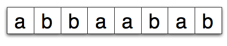
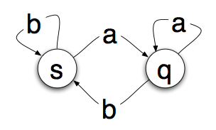

title: 计算机基础概念：状态机
author: cwen
date: 2020-08-06
update: 2020-08-06
tags:
    - Raft
    - 计算机概念

--------

最近在看 Raft 算法的时候，在论文中提到了状态机的概念，说实话其实一开始还是很懵逼，并不知道这个状态机为何物（有点丢人），于是乎就去学习了一波，这里只是做一个简单的整理和记录。

<!--more--> 

## 定义

状态机是有限状态机的简称 （fsm），用于设计算法的数学抽象，简单来说，状态机将读取一系列输入，当它读取输入时，将切换到一个特定的状态，并且当输入不变的时候，每次的切换到的状态也是不变的。这些相互切换的状态数量是有限的。

## 案例解释

想象一下，有这样一个设备可以读取一系列输入，输入的内容是一段连续的字母，这段字母中只包含了 a 和 b。 



把这个设备看作一个状态机，当状态机读取每一个字母的时候，它会改变状态，并且它只有两个状态 s 和 q 。



上图中圆圈中是状态机可以进入的 “状态”。箭头代表过度。所以如果你在状态 s 中读取到 a 你就会转变为状态 q，如果你读取了一个 b，那么就会停留在 s 状态。这样可以看出来，给定一个输入以及知道当前的自己状态，我们很容易推算出输出的结果，这里和很好的符合了一个数学模型抽象的概念。

## 程序中的状态机

从上面可以得知状态机并不是实际的机器设备，而是一个数学模型，通常体现为一个状态转换图。同样在我们日常编程代码实现中，其实我们也是经常使用到的，这里我想当一个经典的案例就是 TCP 的状态转换:  


从上图可以看出，整体的 TPC 状态转换图也可以称为一个状态机。这是复制案例，在编程中简单的状态机器实现其实很简单，就比使用简单 `if...else...` 或者 `switch` 就可以办到: 

```c
// 定义状态
enum {
  GOOD,
  BAD,
}

int main() {
  int state = GOOD;
  while (1) {
    if (state == GOOD) {
      xxx; // 具体调用函数
      state = BAD；// 状态转移
    } else if (state == BAD) {
      xxx; // 具体调用函数
      state == GOOD;
    }
  }
}
```

上面可以说是一个最简单的状态机了，里面之涉及到两个状态之间的转移。由此可见其实状态机其实是我们编程中最最基本的一种编程思想了😂。

## 参考

1. [State Machines – Basics of Computer Science](https://blog.markshead.com/869/state-machines-computer-science/) 
2. [Wiki](https://en.wikipedia.org/wiki/Finite-state_machine)
3. [什么是状态机](https://zhuanlan.zhihu.com/p/47434856)


