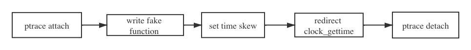

title: 在容器中让时间自由摇摆
author: cwen
date: 2020-03-12
update: 2020-03-12
tags:
    - Chaos Mesh
    - Chaos engingeering
    - Docker
    - Kubernetes
    - time skew
    - test

---

[Chaos Mesh](https://github.com/pingcap/chaos-mesh) 是最近开源的 Kubernetes 混沌测试平台，并且最近支持了一个 TimeChaos 的新功能，用来模拟 Time skew 的情况，通常情况下，我们知道直接修在容器中修改时间，会影响整个物理节点, 这不是我们想要的，那么 Chaos Mesh 是如何解决这个问题的呢？接下来就让我们一起探索一下 Chaos Mesh 是如何在容器中让时间自由摇摆的！
<!--more-->

## Time skew 是什么

Time Skew 直接翻译就是时间偏移，白话一点就是我们从节点上获取的时候和当前真实的实现出现偏差。

## 为什么需要模拟 Time skew 呢？

分布式数据库要实现全局一致性快照，需要解决不同节点之间时钟一致的问题。工业界目前有三种解决方案：  

1. 全局集中式授时服务   
2. 混合逻辑时钟（HLC）    
3. 原子钟Turetime。    

这里不具体解释具体的实现原理和优缺点，简单来说都是为了保证时钟的一致性，但是往往物理节点上的物理时间总是会出现偏差，不管是使用 NPT 服务同步也好，或者其他方法总是没办法完全避免出现误差，这时候如果我们的应用不能够很好的处理这样的情况的话，就可能造成无法预知的错误。

## 物理节点上可以肿么做？ 

在物理节点可以直接使用 `date -s` 命令修改时间, 但需要注意的是此修改会影响整个节点上的时间，也就是其他进程也会受到影响。

示例： 

```
# 将系统日期设定成2009年 9月3日的命令
date -s 9/03/2009

# 将系统时间设定成下午5点55分55秒的命令
date -s 17:55:55
``` 


## Jepsen 是肿么做的？  

Jepsen 是目前比较流行的验证分布式一致性验证框架，采用函数式编程语言 Clojure 编写（不得不说之前搞 Jepsen 的时候，差点被 clojure 搞疯）。Jepsen 也提供了 time skew 功能，在 Jepsen 里是直接使用了一段 C 代码来搞定的:

```
....
    /* Set time */
    if (0 != settimeofday(&time, &tz)) {
      perror("settimeofday");
      return 2;
    }
....

```
详细实现：https://github.com/jepsen-io/jepsen/blob/master/jepsen/resources/bump-time.c 

简单解释一下就是使用了 `settimeofday` 时间函数来设置系统时间。

## 探索 Docker 中的实现方式

由于 Jepsen 实现中直接是调用了 `settimeofday` 操作设置时间，这样的操作会导致整个物理节点上的时间都发生改变，但是 Chaos Mesh 是运行在 Kubernetes 上的，如果我们给某个进程注入 time skew 导致整个物理节点都出现了时间问题，那么会影响整个 node 上其他的容器，这是我们无法容忍。所以直接通过 `data` 命令或者是直接使用 `sttimeofday` 之类的时间函数是行不通的，那么挑战来了，在该肿么去达到我们想要的效果呢？

首先我们想到使用 BPF 通过内核的方向寻找突破口，幸好我们 Team 有一位 Kernel 方面的专家，这一光荣挑战性的任务就落在了他的头上，接下来分析几个我们探索的思路 

###  使用 LD_PRELOAD 

`LD_PRELOAD` 是 Linux 系统的一个环境变量，它可以影响程序的运行时的链接（Runtime linker），它允许你定义在程序运行前优先加载的动态链接库。这个功能主要就是用来有选择性的载入不同动态链接库中的相同函数。通过这个环境变量，我们可以在主程序和其动态链接库的中间加载别的动态链接库，甚至覆盖正常的函数库。一方面，我们可以以此功能来使用自己的或是更好的函数（无需别人的源码），而另一方面，我们也可以以向别人的程序注入程序，从而达到特定的目的。 

对于使用应用程序调用时间函数是使用 glibc 的方式话， `LD_PRELOAD` 是可以生效的，比如 Rust, C ， 但是对于有些程序比如 Golng，Golang 会直接解析 [vDSO](http://man7.org/linux/man-pages/man7/vdso.7.html) 段获取时间函数地址跳转过去，因此无法使用 `LD_PRELOAD` 的方式拦截 glibc 接口.

下面简单解释一下 VDSO 

> VDSO (virtual dynamic share object) 是一种加速方法，内核开发人员发现有个别系统调用只会产生读 kernel 内存操作，而从来不写，但出于安全性用户地址空间和内核地址空间是分离的。每次读都会发生特权级切换，开销很大。因为只读，所以内核开发人员决定干脆将这些地址放在一个区域，虽然从地址空间范围来看属于内核地址空间，但把它算成是用户态地址空间，地址里面的值的更新由内核态来负责，用户态的程序去读区这段内存和访问用户态程序一样 （gdb 可以直接 step 进去），这样就大幅度的提高了性能。 

由于 `LD_PRELOAD` 的局限性，所以这个思路看起来行不通

### 使用 BPF 修改系统调用 clock_gettime 返回值 

我们可以使用 BPF 对任务的 PID 进行过滤这样我们就可以通过只对具体的某个进程进行 time skew, 并且通过修改系统调用 clock_gettime 的返回值实现我们的目的。这个思路看似很好，但是问题来了，clock_gettime 绝大数情况下是通过 VDSO 加速，并不会进行真正的系统调用，呱唧一下，走不通了，最后查到，如果我们的系统内核版本 4.18 及以上的话，并且使用 [HPET](https://www.kernel.org/doc/html/latest/timers/hpet.html) 时钟，clock_gettime 系统调用在 VDSO 中是不生效的，并且会正常走系统调用。

并且我们使用上述方案实现了一版 [time skew](https://github.com/chaos-mesh/bpfki), 并且经过测试对于 Rust, C 这样的程序是可以正常工作的，但是对于 Golang 这样的程序来说获取时间是正常的，但是出现一个问题就是如果程序在被注入 time skew 的期间，执行 sleep 操作的话，sleep 操作存在很大可能会被 block 住（time skew 取消后依然无法恢复），经过排查怀疑是因为 bpf 会在系统调用返回前修改用户态地址空间 （存储 timeval 或 timspec 的地方），而 golang 的 runtime 为了防止阻塞，会把这个调用系统调用的 G 丢出去，新的 G 和 P 绑定，那么那块地址空间可能会被新绑定的 G 访问 ，导致了 panic 或 hang。（具体问题的原因还没完全确定）

好了上面简单描述了两种我们在探索中想到的两种方案，都存在些局限性和问题，那么最后在 Chaos Mesh 中是真正如何去实现的呢？

不得说现在的实习生太强了，最终我们使用的方式是我们 Team 一实习生提出来并实现的，吹爆他，特别 hack 的方案，下面就一探究竟...

## [Chaos Mesh](https://github.com/pingcap/chaos-mesh) 中落地

从上面探索方案中可以知道，正常程序获取系统是时间绝大多数情况下是通过 clock_gettime 实现的，只是我们的 clock_gettime 刚好是使用 vDSO 加速，导致我们没办法好直接使用 LD_PRELOAD 方式去 hack clock_gettime 的系统调用，那么我们就从 VDSO 着手解决这个问题，如果我们可以把 VDSO 中记录 clock_gettime 结果的地址指向一个我们自己定一个的实现就好了，理想是美好的，但现实总是残酷，要达到这个效果，我们需要解决如下几个问题：

* 需要知道 VDSO 段的用户态地址 
* 如果要通过内核态的任意地址更改 vDSO 段中 clock_gettime 函数的内容，需要知道 VDSO 段的内核态地址 
* 如何去修改 VDSO 段中的数据 


首先我们先看看 VDSO 是个什么样子的, 我们可以通过查看的 `/proc/pid/maps` 中查看到 VDSO 的内存地址： 

```
$ cat /proc/pid/maps 
...
7fa931533000-7fabb1533000 r--s 00000000 08:03 13631798                   /var/lib/etcd/member/snap/db
7fabb1533000-7fabb1cf3000 rw-p 00000000 00:00 0
7fae3192b000-7fae31f33000 rw-p 00000000 00:00 0
7ffe530fc000-7ffe5311d000 rw-p 00000000 00:00 0                          [stack]
7ffe53143000-7ffe53145000 r-xp 00000000 00:00 0                          [vdso]
``` 

最后一行就是 VDSO 的相关信息，可以看到这段内存空间的权限是 `r-xp` ，可读可执行但是不可写，也就是我们在用户态没办法去修改这段内存，为了实现可以去修改 VDSO, 我们选择使用 [ptrace](http://man7.org/linux/man-pages/man2/ptrace.2.html) 搞事情。 


接下来我们看看这个 VDSO 里面具体有些什么，我们可以使用 gdb dump memory 直接把 VDSO 导出来，并且可以使用 `objdump` 查看一下具体内容： 

```
(gdb) dump memory vdso.so 0x00007ffe53143000 0x00007ffe53145000 


$ objdump -T vdso.so

vdso.so:     file format elf64-x86-64

DYNAMIC SYMBOL TABLE:
ffffffffff700600  w   DF .text	0000000000000545  LINUX_2.6   clock_gettime
0000000000000000 g    DO *ABS*	0000000000000000  LINUX_2.6   LINUX_2.6
ffffffffff700b50 g    DF .text	00000000000002b4  LINUX_2.6   __vdso_gettimeofday
ffffffffff700e30 g    DF .text	000000000000003d  LINUX_2.6   __vdso_getcpu
ffffffffff700b50  w   DF .text	00000000000002b4  LINUX_2.6   gettimeofday
ffffffffff700e10  w   DF .text	0000000000000016  LINUX_2.6   time
ffffffffff700e30  w   DF .text	000000000000003d  LINUX_2.6   getcpu
ffffffffff700600 g    DF .text	0000000000000545  LINUX_2.6   __vdso_clock_gettime
ffffffffff700e10 g    DF .text	0000000000000016  LINUX_2.6   __vdso_time
```

其实整个 VDSO 可以看作是一个 `.so` 的文件，这样我们就可以直接使用 `ELF` 文件处理方式，来格式化 VDSO。说到这里我们实现 time skew 的基本思路已经有了： 



上述流程图即为 Chaos Mesh 中 TimeChaos 的实现基本流程

* 第一步我们会先使用 ptrace attach 指定的 pid 进程，让当前进程处于 stop 状态 
* 接着使用 ptrace 在进程内存中映射出一段内存空间将我们自己的 `fake_clock_gettime` 使用 `process_vm_writev` 写到内存空间中 
* 将指定的参数通过 `process_vm_writev` 写到 `fake_clock_gettime` 中，这里的参数是指我们真正想要注入的时间，比如往前 2h, 往后 2d 之类的参数 
* 接着使用 ptrace 修改 VDSO 中 `clock_gettime` 函数部分，直接跳转到 `fake_clock_gettime` 函数上。 
* 最后 ptrace detch 

具体实现可以参考：https://github.com/pingcap/chaos-mesh/blob/master/pkg/time/time_linux.go  

## 最后 

最后说点啥呢？欢迎大家入坑 [Chaos Mesh](https://github.com/pingcap/chaos-mesh)
